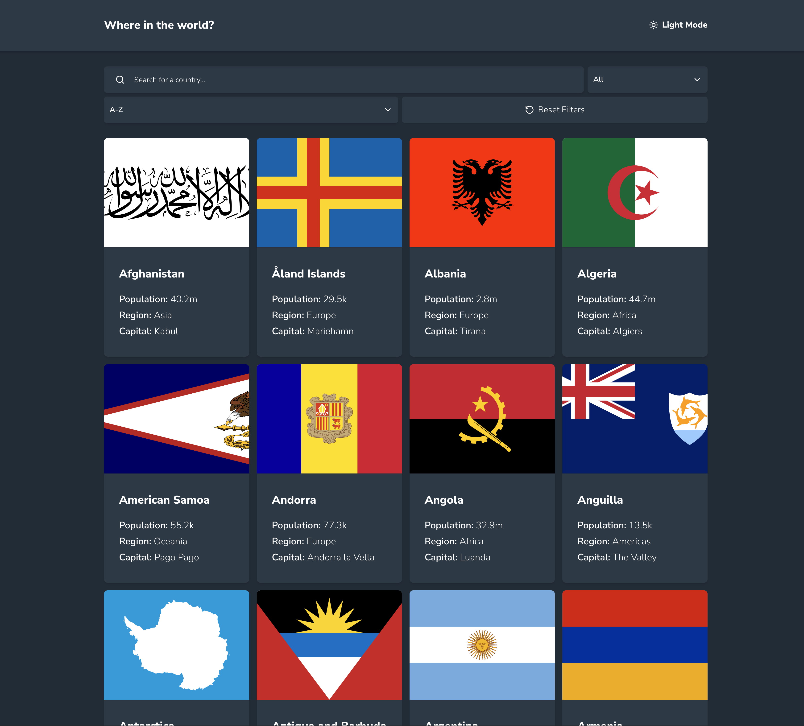

# Frontend Mentor - REST Countries API with color theme switcher

This is a solution to the [REST Countries API with color theme switcher challenge on Frontend Mentor](https://www.frontendmentor.io/challenges/rest-countries-api-with-color-theme-switcher-5cacc469fec04111f7b848ca). Frontend Mentor challenges help you improve your coding skills by building realistic projects.

### The challenge

Users should be able to:

- See all countries from the API on the homepage
- Search for a country using an `input` field
- Filter countries by region
- Click on a country to see more detailed information on a separate page
- Click through to the border countries on the detail page
- Toggle the color scheme between light and dark mode _(optional)_

### Screenshot

### Links

- Solution URL: [FEM-REST Countries API](https://github.com/mattdavis06/fem-rest-countries-api)
- Live Site URL: [rest-countries-api](TBA)

### Built with

- Semantic HTML5 markup
- CSS Flexbox
- CSS Grid
- [TailwindCSS](https://tailwindcss.com/) - Utility-first CSS framework
- [Shadcn](https://arc.net/l/quote/aauthmgi) - A UI component library primarily used for React development that allows you to build modern, customizable, and accessible web interfaces.
- [React](https://reactjs.org/) - JS library
- [NextJS](https://nextjs.org/) - React framework for the web
- [TypeScript](https://www.typescriptlang.org/) - Superset of JavaScript
- [Zustand](https://zustand-demo.pmnd.rs/) - A small, fast and scalable bearbones state-management solution using simplified flux principles.
- Mobile-first workflow

## Author

- Website - [mdavis.dev](https://www.mdavis.dev)
- Frontend Mentor - [@mattdavis06](https://www.frontendmentor.io/profile/mattdavis06)
